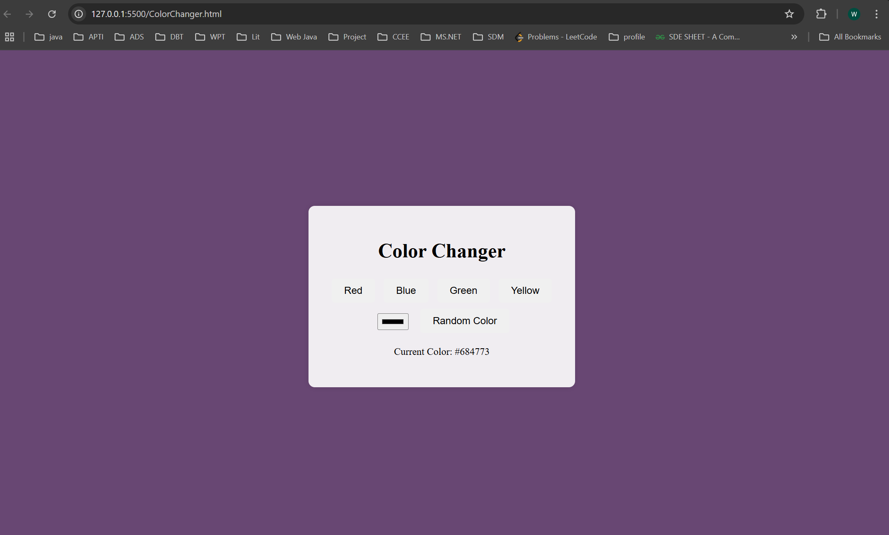

# Color Changer

This project demonstrates a simple color changer built using HTML, CSS, and JavaScript.

## Output

Below is an example of how the ColorChanger.html works:

## How to Use

1. Open the `ColorChanger.html` file in your browser.
2. Click the buttons to change the background color dynamically.

## Files in the Project

- `ColorChanger.html` - The main HTML file.
- `style.css` - Contains the styling for the project.
- `script.js` - Contains the JavaScript logic for changing colors.

## Setup

1. Clone the repository.
2. Open the project folder and run the `ColorChanger.html` file in your browser.

Enjoy experimenting with colors!