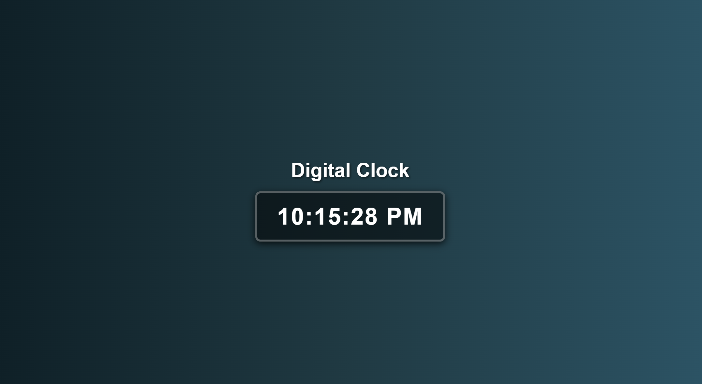

# Digital Clock

This project is a simple digital clock built using HTML, CSS, and JavaScript.

## Preview

> If you want to see the live demo, open the `DigitalClock.html` file in your browser.

## How to Run

1. Clone this repository.
2. Open the `DigitalClock.html` file in any modern web browser.